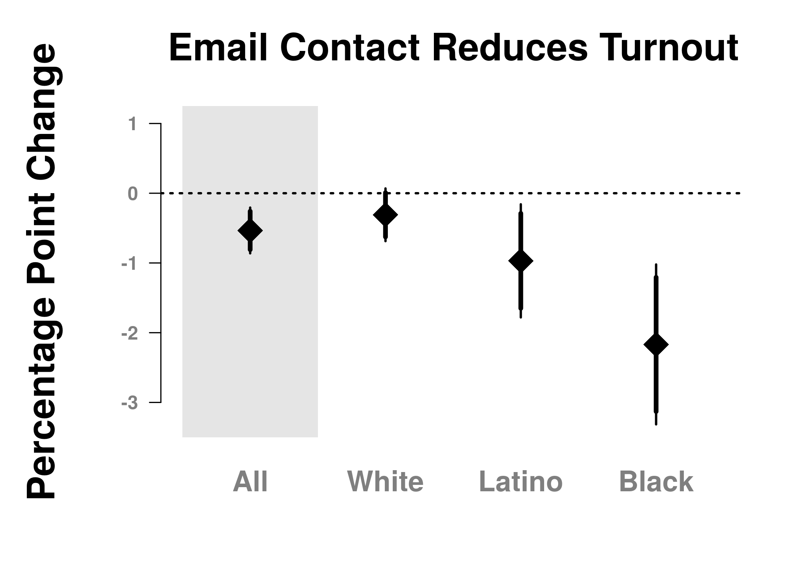

Analysis: Email Mobilization Messages Suppress Turnout Among Black and
Latino Voters: Experimental Evidence From the 2016 General Election
================
Michael U. Rivera, D. Alex Hughes, Micah Gell-Redman

# Setup

Load packages.

``` r
library(data.table)
library(lfe)
library(sandwich)
library(stargazer)

knitr::opts_chunk$set(dpi = 300)
```

Remove anything from the working directory and print the system frame
we’re working with.

``` r
rm(list = ls())
sys.frame()
```

    ## <environment: R_GlobalEnv>

Load functions for analysis.

``` r
source('/home/rstudio/src/functions.R')
```

We exclude from this sample voters who voted early, but we include
voters who voted by mail. In the SI, we examine the consequences of
changing the analytic frame to include vote-by-mail voters. There is no
substantive change in the interpretation of any result, though the
effects are slightly stronger. An interested researcher could change the
exclusion set here to exclude vote-by-mail voters by changing the
`exclusion_set` variable to be `exclusion_set <- c('E', 'A')`

``` r
exclusion_set <- c('E')
```

# Load Data

Load data using the `load_and_clean_data` function described in
`./src/`. This uses `data.table::fread` and then recodes variables for
use. If the researcher has saved a local copy of the data, they can set
`load_and_clean_data` to read from the locally saved file. Or, if the
researcher is reading from the remotly stored data (e.g. the s3 bucket
or Dataverse), they can pass the URL of that data.

``` r
# d <- load_and_clean_data(
#   f = 'https://florida-voters.s3-us-west-1.amazonaws.com/subset_finalAnalysisFile20170711.csv')
d <- load_and_clean_data(
  f = '/home/rstudio/data/subset_finalAnalysisFile20170711.csv')
```

# Analysis

## Simple Descriptive Statistics

Our overall turnout is in line with repoerts from the (Florida Secretary
of
State)\[<https://dos.myflorida.com/elections/data-statistics/elections-data/voter-turnout/>\].

``` r
d[ , mean(outcome)]
```

    ## [1] 0.7593811

We also report the proportion of voters voting early, with a slight
discrepancy due to our data being more up to date than those of the
Department of State.

``` r
d[ , sum(historyCode2016 == 'E')]
```

    ## [1] 3915227

The same is true for voting by mail

``` r
d[ , sum(historyCode2016 == 'A')]
```

    ## [1] 2899020

In total, how many people voted *before* the election took place?

``` r
format(d[historyCode2016 %in% c("A", "E"), .N], big.mark = ',')
```

    ## [1] "6,814,247"

What is that, as a proportion of the total registered voting set in FL?

``` r
d[ , sum(historyCode2016 %in% c('A', 'E'))/ .N]
```

    ## [1] 0.525408

Among the analytic sample the turnout rate is:

``` r
d[!(historyCode2016 %in% exclusion_set), mean(outcome)]
```

    ## [1] 0.6553326

Approximately 5% of the Florida voting population provide an email
address.

``` r
d[ , mean(validEmail)]
```

    ## [1] 0.04855553

The rate of email address provision is lower in among the analytic
sample

``` r
d[!(historyCode2016 %in% exclusion_set), mean(validEmail)]
```

    ## [1] 0.04523574

## Table 2: Comparison of Email Providers

This section produces tables that are Table 2 in the published text.
This first table compares people who provide email addresses to those
who do not provide email addresses. It also shows how the analytic
sample – those who provide email addresses and do not vote early –
compare to the general population.

``` r
## This chunk builds the summary table that compares: 
##   (1) All Florida registered voters; 
##   (2) Those Florida registered voters who provide email addresses; and, 
##   (3) Those Florida registered voters who provide a valid email and were
##       assigned to an experimental condition.

summary_table <- d[ , .(
    "Two Party Dem. VS" = sum(party=="DEM") / sum(party%in%c("DEM", "REP")),
    "SE" = (sum(party=="DEM") / sum(party%in%c("DEM", "REP"))*(1-sum(party=="DEM") / sum(party%in%c("DEM", "REP"))))/.N,
    "Age in 2016" = mean(age, na.rm=TRUE),
    "SE" = sem(age),
    "Proportion Female" = mean(gender=="F", na.rm=TRUE),
    "SE" = sem(gender=="F"),
    "Proportion non-White" = mean(minority, na.rm=TRUE),
    "SE"  = sem(minority),
    "N" = .N
    ), 
    by = .("Data Set" = validEmail)]

summary_table_1 <- t(summary_table)

## Now, compare only the experimental Data 
summary_table <- d[
    treat %in% 0:4,
    .("Data Set" = 2, 
      "Two Party Dem. VS" = sum(party=="DEM") / sum(party%in%c("DEM", "REP")),
      "SE" = (sum(party=="DEM") / sum(party%in%c("DEM", "REP"))*(1-sum(party=="DEM") / sum(party%in%c("DEM", "REP"))))/.N,
      "Age in 2016" = mean(age, na.rm=TRUE),
      "SE" = sem(age),
      "Proportion Female" = mean(gender=="F", na.rm=TRUE),
      "SE" = sem(gender=="F"),
      "Proportion non-White" = mean(minority, na.rm=TRUE),
      "SE"  = sem(minority),
      "N" = .N)]

summary_table_2 <- t(summary_table)

## now only analytic sample 
summary_table <- d[
    treat %in% 0:4 & !(historyCode2016 %in% exclusion_set),
    .("Data Set " = 3, 
      "Two Party Dem. VS" = sum(party=="DEM") / sum(party%in%c("DEM", "REP")),
      "SE" = (sum(party=="DEM") / sum(party%in%c("DEM", "REP"))*(1-sum(party=="DEM") / sum(party%in%c("DEM", "REP"))))/.N,
      "Age in 2016" = mean(age, na.rm=TRUE),
      "SE" = sem(age),
      "Proportion Female" = mean(gender=="F", na.rm=TRUE),
      "SE" = sem(gender=="F"),
      "Proportion non-White" = mean(minority, na.rm=TRUE),
      "SE"  = sem(minority),
      "N" = .N)]

summary_table_3 <- t(summary_table)

## Combine these tables 
summary_table <- cbind(summary_table_1, summary_table_2, summary_table_3)

## And print to the screen. 
stargazer(
  summary_table, 
  type = "text", 
  title = "Comparison of Email Providers",
  summary = F, digits = 3
  )
```

    ## 
    ## Comparison of Email Providers
    ## =======================================================
    ## Data.Set                 0         1       2       3   
    ## Two.Party.Dem..VS      0.513     0.515   0.521   0.513 
    ## SE                    0.00000   0.00000 0.00000 0.00000
    ## Age.in.2016            51.517   45.726  45.502  45.259 
    ## SE.1                   0.005     0.023   0.026   0.033 
    ## Proportion.Female      0.528     0.523   0.522   0.521 
    ## SE.2                   0.0001    0.001   0.001   0.001 
    ## Proportion.non.White   0.286     0.314   0.322   0.304 
    ## SE.3                   0.0001    0.001   0.001   0.001 
    ## N                    12,339,702 629,738 503,859 328,181
    ## -------------------------------------------------------

``` r
## This call produces a file called `table1_raw.tex` in the folder `./tables-figures`. 
## It is the second table in the published document (sorry for the numbering...)
## The final version that is in the document makes formatting changes, to meet 
## JEPS formatting standards but does not change information. 
```

``` r
stargazer(
  summary_table, 
  type = "latex", 
  out = "table1_raw.tex", 
  title = "Comparison of Email Providers", 
  summary = F, digits = 3
)
```

## Randomization Check

First, look at everybody: remember these all need be pre-treatment. As
well, remember that people who do /not/ provide emails are not being
used in our comparison. So, differences between them and the treatment
sets are (a) to be expected and (b) are going to fall out when we
conduct the analysis.

``` r
randomizationCheck <- d[
    !(is.na(treat)) , .(
      "Two Party D VS." = sum(party=="DEM") / sum(party%in%c("DEM", "REP")),
        "SE" = (sum(party=="DEM") / sum(party%in%c("DEM", "REP"))) * (1 - sum(party=="DEM") / sum(party%in%c("DEM", "REP")))/.N,
        "Voted in 2016"  = mean(general12, na.rm = TRUE),
        "SE" = sem(general12),
        "Age in 2016" = mean(age, na.rm=TRUE),
        "SE" = sem(age),
        "Proportion Female" = mean(gender=="F", na.rm=TRUE),
        "SE" = sem(gender=="F"),
        "Proportion non-White"  = mean(minority, na.rm=TRUE),
        "SE" = sem(minority),
        "Observations" = .N),
    keyby = .(treat)]
randomizationCheck[ , treat := c('Control', 'Baseline', 'General Norm', 'Ethnic Norm 1', 'Ethnic Norm 2')]

randomizationCheck <- t(randomizationCheck)

stargazer(randomizationCheck,
          type="text",
          summary=F, digits=2, digits.extra=0,
          title="Covariate Balance Check", 
          column.labels = c('Control', 'Baseline', 'General Social Norm', 'Ethnic Norm 1', 'Ethnic Norm 2')
        )
```

    ## 
    ## Covariate Balance Check
    ## =======================================================================================
    ## treat                  Control      Baseline   General Norm Ethnic Norm 1 Ethnic Norm 2
    ## Two.Party.D.VS.       0.5204549    0.5235122    0.5200782     0.5213443     0.5203555  
    ## SE                   2.458617e-06 2.470165e-06 2.489297e-06 2.484562e-06  2.479590e-06 
    ## Voted.in.2016         0.5167566    0.5156272    0.5190684     0.5134947     0.5194494  
    ## SE.1                 0.001653503  0.001658772  0.001666269   0.001663004   0.001663254 
    ## Age.in.2016            45.49453     45.49869     45.45720     45.51412      45.54746   
    ## SE.2                  0.05789006   0.05799088   0.05838514   0.05835490    0.05822494  
    ## Proportion.Female     0.5242875    0.5223402    0.5207045     0.5186284     0.5220951  
    ## SE.3                 0.001567467  0.001571853  0.001577678   0.001576600   0.001574446 
    ## Proportion.non.White  0.3217125    0.3242098    0.3223661     0.3208248     0.3209148  
    ## SE.4                 0.001466163  0.001472973  0.001476023   0.001472916   0.001471429 
    ## Observations            101513       100984       100268       100438        100656    
    ## ---------------------------------------------------------------------------------------

Consistent with Green and Gerber (2012), here we examine whether any of
the covariate featuers that we posess predict treatment. There is no
evidence of a
problem.

``` r
anova_data <- na.omit(d, cols = c("general12", "gender", "race", "party", "congressionalDistrict", "recent", "treat"))

conditions <- 1:4
for(i in 1:length(conditions)) {
    short_model = lm(I(treat == 0) ~ 1, data=anova_data[treat %in% c(0, conditions[i])])
    long_model  = lm(I(treat == 0) ~ 1 + general12 + gender + race
                     + party + congressionalDistrict + recent,
                     data = anova_data[treat%in%c(0, conditions[i])])
    print(anova(long_model, short_model, test = 'F')[[6]][2])
}
```

    ## [1] 0.4871393
    ## [1] 0.3176966
    ## [1] 0.1489855
    ## [1] 0.6793321

## Analysis of Treatment

As a reminder, the treatment indicator is coded in the following way:

    0: Control 
    1: baseline. "information" 
    2: baseline, "social pressure"
    3: "native threat" 
    4: "latino group threat"

Compute the mean and standard error of the mean for all individuals
assigned to a treatment in the analytic sample.

``` r
d[ treat %in% 0:4 & !(historyCode2016 %in% exclusion_set),
  .(meanVote = mean(outcome),
    semVote  = sem(outcome) ),
  keyby = .(treat) ] 
```

    ##    treat  meanVote     semVote
    ## 1:     0 0.7865179 0.001593428
    ## 2:     1 0.7818532 0.001608161
    ## 3:     2 0.7802808 0.001619249
    ## 4:     3 0.7821922 0.001615982
    ## 5:     4 0.7804610 0.001617771

These models are the core models reported in the text.

``` r
model0 <- d[treat %in% 0:4 & !(historyCode2016 %in% exclusion_set), 
            lm(outcome ~ factor(treat != 0))]
model1 <- d[treat %in% 0:4 & !(historyCode2016 %in% exclusion_set),
            lm(outcome ~ factor(treat!=0) + factor(major_party) + race3
            + age + I(age^2) + registrationYear)]

## This model, model1_fe, is the principle model reported in the text, both for the 
## results section in text, and also the plots and are included. Note that 
## the results in this model are _very_ similar to those in model1 reported above. 

model1_fe <- d[treat %in% 0:4 & !(historyCode2016 %in% exclusion_set),
               felm(outcome ~ factor(treat != 0) + factor(major_party) + race3
            + age + I(age^2) + registrationYear | factor(congressionalDistrict))]
model2 <- d[treat %in% 0:4 & !(historyCode2016 %in% exclusion_set),
            lm(outcome ~ factor(treat) + factor(major_party) + race3
            + age + I(age^2) + registrationYear)]
model2_fe <- d[treat %in% 0:4 & !(historyCode2016 %in% exclusion_set),
               felm(outcome ~ factor(treat) + factor(major_party) + race3
            + age + I(age^2) + registrationYear | factor(congressionalDistrict))]
```

Print the core results tables.

``` r
stargazer(model0, model1, model1_fe, model2, model2_fe,
          type = 'text', 
          se = list(
           ols_rses(model0), ols_rses(model1), felm_rses(model1_fe), 
           ols_rses(model2), felm_rses(model2_fe)),
          covariate.labels = c(
            'Any Email', 'Baseline', 'General Descriptive Social Norm',
            'Ethnic Descriptive Social Norm 1', 'Ethnic Descriptive Social Norm 2', 
            'Republican', 'Independent', 
            'Black', 'Latino', 'Other', 
            'Age', 'Age2', 'Registration Year'),
          omit.stat = c('ser', 'F'), 
          digits = 4, 
          add.lines = list(
            c('Congressional District FE', 'No', 'No', 'Yes', 'No', 'Yes')),
          title = 'Main Effects of Treatment'
)
```

    ## 
    ## Main Effects of Treatment
    ## =======================================================================================
    ##                                                   Dependent variable:                  
    ##                                  ------------------------------------------------------
    ##                                                         outcome                        
    ##                                           OLS             felm       OLS        felm   
    ##                                     (1)        (2)        (3)        (4)        (5)    
    ## ---------------------------------------------------------------------------------------
    ## Any Email                        -0.0053*** -0.0054*** -0.0053***                      
    ##                                   (0.0018)   (0.0017)   (0.0017)                       
    ##                                                                                        
    ## Baseline                                                          -0.0044**  -0.0044** 
    ##                                                                    (0.0021)   (0.0021) 
    ##                                                                                        
    ## General Descriptive Social Norm                                   -0.0059*** -0.0057***
    ##                                                                    (0.0021)   (0.0021) 
    ##                                                                                        
    ## Ethnic Descriptive Social Norm 1                                  -0.0049**  -0.0048** 
    ##                                                                    (0.0021)   (0.0021) 
    ##                                                                                        
    ## Ethnic Descriptive Social Norm 2                                  -0.0063*** -0.0063***
    ##                                                                    (0.0021)   (0.0021) 
    ##                                                                                        
    ## Republican                                   -0.0016    -0.0023    -0.0016    -0.0023  
    ##                                              (0.0016)   (0.0016)   (0.0016)   (0.0016) 
    ##                                                                                        
    ## Independent                                 -0.1023*** -0.1022*** -0.1023*** -0.1022***
    ##                                              (0.0018)   (0.0018)   (0.0018)   (0.0018) 
    ##                                                                                        
    ## Black                                       -0.1355*** -0.1254*** -0.1355*** -0.1254***
    ##                                              (0.0027)   (0.0028)   (0.0027)   (0.0028) 
    ##                                                                                        
    ## Latino                                      -0.0422*** -0.0438*** -0.0422*** -0.0438***
    ##                                              (0.0019)   (0.0022)   (0.0019)   (0.0022) 
    ##                                                                                        
    ## Other                                       -0.0628*** -0.0601*** -0.0629*** -0.0601***
    ##                                              (0.0030)   (0.0030)   (0.0030)   (0.0030) 
    ##                                                                                        
    ## Age                                         0.0158***  0.0159***  0.0158***  0.0159*** 
    ##                                              (0.0002)   (0.0002)   (0.0002)   (0.0002) 
    ##                                                                                        
    ## Age2                                        -0.0001*** -0.0001*** -0.0001*** -0.0001***
    ##                                             (0.000002) (0.000002) (0.000002) (0.000002)
    ##                                                                                        
    ## Registration Year                           -0.0035*** -0.0033*** -0.0035*** -0.0033***
    ##                                              (0.0001)   (0.0001)   (0.0001)   (0.0001) 
    ##                                                                                        
    ## Constant                         0.7865***  7.3704***             7.3708***            
    ##                                   (0.0016)   (0.1194)              (0.1194)            
    ##                                                                                        
    ## ---------------------------------------------------------------------------------------
    ## Congressional District FE            No         No        Yes         No        Yes    
    ## Observations                      328,181    327,952    327,952    327,952    327,952  
    ## R2                                0.00003     0.1270     0.1300     0.1270     0.1300  
    ## Adjusted R2                       0.00002     0.1269     0.1299     0.1269     0.1299  
    ## =======================================================================================
    ## Note:                                                       *p<0.1; **p<0.05; ***p<0.01

There is no evidence of message effects. To test for this, we conduct an
anova of a model that stipulates all messages have the same effect
against a model that allows each model to have an unique effect.
Rejecting the null hypothesis would indicate that there is a
message-based effect. But, there is no such evidence.

``` r
anova_result <- anova(model2, model1, test = "F")
anova_result
```

    ## Analysis of Variance Table
    ## 
    ## Model 1: outcome ~ factor(treat) + factor(major_party) + race3 + age + 
    ##     I(age^2) + registrationYear
    ## Model 2: outcome ~ factor(treat != 0) + factor(major_party) + race3 + 
    ##     age + I(age^2) + registrationYear
    ##   Res.Df   RSS Df Sum of Sq      F Pr(>F)
    ## 1 327939 48778                           
    ## 2 327942 48778 -3  -0.15335 0.3436 0.7938

As is evident in the analysis above, there is little evidence to suggest
that there is a difference in turnout, based on the message sent to
voters. The lack of effect is evident in the following plot.

``` r
plot_message(model2_fe, make_pdf = TRUE, file = 'message_effects.pdf')
```

    ## png 
    ##   2

## Treatment Effects Among Specific Groups

The average rate of turnout among those in the analytic sample who were
assigned to control is about 78.7. This section of code produces Figure
1 in the published
document.

``` r
mu_control <- round(d[treat %in% 0 & !(historyCode2016 %in% exclusion_set), mean(outcome)], 4)
mu_control
```

    ## [1] 0.7865

How many people are there in each racial/ethnic
group?

``` r
d[treat %in% 0:4 & !(historyCode2016 %in% exclusion_set), .N, keyby = .(race3)]
```

    ##     race3      N
    ## 1:  White 204054
    ## 2:  Black  36518
    ## 3: Latino  63404
    ## 4:  Other  24205

The by group estimates reported in the main body of the paper work in
the following way:

1.  We estimate the average turnout in control, for each racial / ethnic
    group with a simple mean.
2.  We report the treatment/control difference that is estimated from a
    model that includes fixed effects for each congressional district,
    as well as a small set of control variables for precision.

Compute the average rate of turnout among those in the analytic sample
who are assigned to control, by racial/ethnic
group.

``` r
mu_all    <- round(d[treat == 0 & !(historyCode2016 %in% exclusion_set),  mean(outcome)], 4)
mu_white  <- round(d[treat == 0 & !(historyCode2016 %in% exclusion_set) & race3 == "White", mean(outcome)], 4)
mu_latino <- round(d[treat == 0 & !(historyCode2016 %in% exclusion_set) & race3 == "Latino", mean(outcome)], 4)
mu_black  <- round(d[treat == 0 & !(historyCode2016 %in% exclusion_set) & race3 == "Black", mean(outcome)], 4)
```

Subgroup Treatment Effects Among: White, Latino, and Black Voters for
Analytic Sample

``` r
mod_all  <- d[treat %in% 0:4 & !(historyCode2016 %in% exclusion_set), 
         felm(outcome ~ factor(treat %in% 1:4) + factor(major_party)
              + age + I(age^2) + registrationYear | congressionalDistrict)]
mod_white <- d[treat %in% 0:4 & !(historyCode2016 %in% exclusion_set) & race3 == "White",
        felm(outcome ~ factor(treat %in% 1:4) + factor(major_party)
             + age + I(age^2) + registrationYear | congressionalDistrict)]
mod_latino <- d[treat %in% 0:4 & !(historyCode2016 %in% exclusion_set) & race3 == "Latino",
        felm(outcome ~ factor(treat %in% 1:4) + factor(major_party)
             + age + I(age^2) + registrationYear | congressionalDistrict)]
mod_black <- d[treat %in% 0:4 & !(historyCode2016 %in% exclusion_set) & race3 == "Black",
        felm(outcome ~ factor(treat %in% 1:4) + factor(major_party)
             + age + I(age^2) + registrationYear | congressionalDistrict)]
```

## In Text Results: Effect by Racial/Ethnic Group

The following table includes estimates of treatment effects grouped for
all voters, and for voters grouped by self-identified race/ethnicity.
These models are reported in-text in **Section 3: Results**.

``` r
stargazer(
  mod_all, mod_white, mod_latino, mod_black,
  se = list(
    felm_rses(mod_all), felm_rses(mod_white), 
    felm_rses(mod_latino), felm_rses(mod_black)), 
  type = 'text', 
  digits = 3, 
  covariate.labels = c(
    'Any Message',
    'Republican', 'Independent',
    'Age', 'Age2',
    'Registration Year'),
  apply.coef = function(x) x * 100, 
  apply.se   = function(x) x * 100, 
  add.lines = list(
    c('DV Mean (Percentage)', 
      round(mu_all * 100, 2), round(mu_white * 100, 2), 
      round(mu_latino * 100, 2), round(mu_black * 100, 2))
  ),
  title = 'Turnout by Racial/Ethnic Group, Percentage Points',
  column.labels = c('All RV', 'White', 'Latino', 'Black')
)
```

    ## 
    ## Turnout by Racial/Ethnic Group, Percentage Points
    ## ==================================================================================================
    ##                                                   Dependent variable:                             
    ##                      -----------------------------------------------------------------------------
    ##                                                         outcome                                   
    ##                            All RV               White              Latino             Black       
    ##                              (1)                 (2)                (3)                (4)        
    ## --------------------------------------------------------------------------------------------------
    ## Any Message               -0.534***            -0.309             -0.970**          -2.168***     
    ##                            (0.167)             (0.193)            (0.414)            (0.585)      
    ##                                                                                                   
    ## Republican                2.080***            0.468***           -1.754***          -6.862***     
    ##                            (0.155)             (0.177)            (0.428)            (1.135)      
    ##                                                                                                   
    ## Independent               -8.994***           -9.752***          -9.765***          -11.214***    
    ##                            (0.183)             (0.231)            (0.394)            (0.601)      
    ##                                                                                                   
    ## Age                       1.637***            1.254***            2.003***           2.065***     
    ##                            (0.020)             (0.025)            (0.049)            (0.072)      
    ##                                                                                                   
    ## Age2                      -0.012***           -0.009***          -0.016***          -0.016***     
    ##                           (0.0002)            (0.0002)            (0.001)            (0.001)      
    ##                                                                                                   
    ## Registration Year         -0.344***           -0.275***          -0.444***          -0.539***     
    ##                            (0.006)             (0.007)            (0.018)            (0.027)      
    ##                                                                                                   
    ## --------------------------------------------------------------------------------------------------
    ## DV Mean (Percentage)        78.65                84                73.93              64.04       
    ## Observations               327,952             203,917             63,369             36,482      
    ## R2                          0.123               0.095              0.107              0.132       
    ## Adjusted R2                 0.123               0.095              0.107              0.131       
    ## Residual Std. Error  0.387 (df = 327919) 0.351 (df = 203884) 0.420 (df = 63336) 0.451 (df = 36449)
    ## ==================================================================================================
    ## Note:                                                                  *p<0.1; **p<0.05; ***p<0.01

# Figure 1

``` r
## This call produces Figure 1 in the published manuscript. 

plot_subgroup(
  model_all = mod_all,
  model_white = mod_white, 
  model_latino = mod_latino, 
  model_black = mod_black
)
```

<!-- -->
